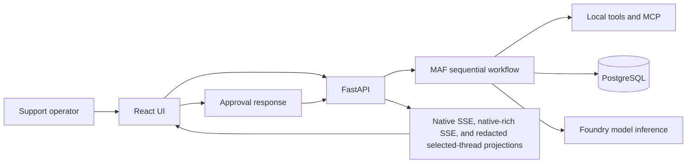

# Architecture: Order Resolution Workflow

## Purpose

This document records the Azure app-hosted Order Resolution architecture as an
explicit 4+1 view model:

1. **Logical view** — business responsibilities and the ordered decision path.
2. **Process view** — request, event, HITL, failure, and recovery behavior.
3. **Development view** — source ownership and stable application contracts.
4. **Physical view** — the intended Azure resources and trust boundaries.
5. **Scenarios (+1)** — concrete operator journeys that verify the other four
   views together.

It describes source and infrastructure intent. It is not evidence that a
deployment, endpoint, trace, evaluation, or Azure resource is currently live.
Current evidence, when authorized and recorded, belongs in
[.azure/deployment-plan.md](../../.azure/deployment-plan.md) and
[issues-changes-fixes.md](issues-changes-fixes.md).

## Business Problem

Support teams need to resolve delivery and product issues promptly while
keeping high-risk actions under explicit human control. The system must:

- complete ordinary, low-risk cases automatically;
- require a deterministic approval decision before a risky action is
  submitted;
- preserve the run, timeline, transcript, checkpoint, and approval data needed
  for audit and recovery; and
- show operators a stable real-time timeline without changing the core
  workflow for each UI surface.

## Project Goal

Deliver a verifiable MAF-based order-resolution application that is:

- **application-hosted:** the FastAPI Container App is the sole MAF
  application runtime;
- **sequential:** triage, policy/MCP retrieval, and resolution execute in
  order within one workflow;
- **decision-safe:** deterministic HITL conditions pause on a durable
  checkpoint and resume only from an explicit approve or reject response;
- **durable:** PostgreSQL retains business workflow state and audit
  projections; and
- **contract-preserving:** native SSE and the existing native-rich SSE
  envelope are stable contracts; AG-UI and CopilotKit are separately additive,
  redacted selected-thread projections.

Foundry is used for configured model inference and report-only evaluation. It
is not an application host, a browser proxy, a FastAPI replacement, or an
alternate orchestration runtime in this lane.

## Logical View

The logical workflow is one ordered decision path:



### Business Decision Model

1. **Triage** persists the user message and produces an order/issue summary.
   With configured Foundry model settings, the MAF
   `SequentialBuilder` uses the configured model client; if those settings are
   absent, the deterministic triage summary remains within this one workflow
   rather than selecting a second orchestrator.
2. **Policy/MCP retrieval** classifies the issue, obtains the local order and
   policy data, and queries the MCP knowledge port. It emits policy-retrieval
   stages and the stable `tool.call` event.
3. **Resolution** selects an action and applies the deterministic approval
   rule. HITL is required for amount/risk at least `100`, a damaged item, or a
   policy containing `manual_review`. The exact rules and test matrix are in
   [hitl-approval-conditions.md](hitl-approval-conditions.md).
4. **Completion or HITL** either submits a low-risk resolution once or writes
   a checkpoint before emitting an approval request. A model-generated
   summary cannot replace the policy or HITL decision.

### Logical Boundaries

- **React UI:** starts a run, consumes the native timeline, reads durable
  history, and lets an operator answer a pending approval.
- **FastAPI application:** is the only HTTP and MAF application host. It
  starts the service/workflow, exposes event/history endpoints, and processes
  approval responses.
- **MAF runtime:** owns the sequential workflow stages, middleware, workflow
  event emission, and the resume behavior.
- **Infrastructure adapters:** own PostgreSQL, MCP, model-client, event-bus,
  and repository access behind ports.
- **Foundry:** supplies a configured model endpoint to the FastAPI-hosted MAF
  client and judges captured runs through report-only evaluation. It never
  takes over the application workflow.

## Process View

### Order-Resolution Message Flow

1. The operator sends `POST /api/chat/run` with the order issue and optional
   thread/session identifiers.
2. `OrderResolutionService` assigns the run/thread/session IDs, creates the
   durable workflow-run record, and invokes the shared workflow in the FastAPI
   process.
3. The workflow persists the user message, emits triage start/completion
   events, and runs the sequential triage path.
4. The policy stage obtains local order/policy data, invokes MCP, and emits
   `workflow.stage` and `tool.call`.
5. Resolution selects the proposed action and deterministically decides
   whether it needs HITL.
6. A low-risk case performs the protected resolution submission, persists the
   assistant message, and emits terminal `workflow.output`.
7. A high-risk case enters the durable HITL branch below instead of submitting
   the action.
8. The event bus sends events to active SSE subscribers and the run projector
   persists the event/run changes for history APIs.

### Durable HITL Pause, Approve/Reject, and Resume

HITL is a durable workflow transition, not a UI-only prompt:

1. The workflow saves a PostgreSQL checkpoint containing the thread, run,
   session, customer, order, action, amount, and sanitized trace context.
2. It emits `checkpoint.created` followed by `hitl.request`, then returns in
   the waiting state. The proposed resolution has not been submitted.
3. The operator calls `POST /api/hitl/respond` with the checkpoint ID,
   `approve` or `reject`, reviewer, and optional comment.
4. The checkpoint repository loads and atomically resolves the pending
   checkpoint. A repeated response does not create another decision or
   terminal event.
5. On **approve**, the workflow emits `hitl.response`, resumes from the
   checkpoint context, makes the idempotent resolution submission, and emits
   `workflow.output` with `completed`.
6. On **reject**, it emits `hitl.response`, records an escalation message,
   and emits `workflow.output` with `escalated`; it does not submit the
   proposed action.

The saved trace context is restored as the parent of the
`workflow.hitl_resume` span, correlating the response and terminal result with
the original waiting operation.

### Failure and Recovery

- Read/model operations have bounded retry behavior. The MCP policy read is
  retried through that read-operation path.
- Resolution submission is side-effecting, so it uses a run/step/business
  idempotency record rather than a blind retry.
- Event persistence is idempotent by event ID, and checkpoint resolution is
  conditional on the pending state.
- The durable recovery boundary is the explicit HITL checkpoint. After a
  process restart, an operator can resume a pending approval from the stored
  checkpoint. The source does not claim generic automatic recovery of every
  in-flight stage that has not reached a checkpoint.
- Native and rich SSE subscriptions use the in-process event bus. They provide
  live delivery, not a durable-stream replay guarantee after an application
  restart; durable run, event, and transcript APIs remain the recovery read
  model.
- Workflow failures emit the supplemental `workflow.failed` event before the
  original error is re-raised. This does not rename or replace the stable
  success/HITL event contract.

## Development View

### Core Modules and Ownership

| Concern | Source ownership | Responsibility |
| --- | --- | --- |
| HTTP/SSE routes | `backend/app/api/v1/routers/*` | Chat, HITL, workflow, session, and health routes. |
| API schemas | `backend/app/api/v1/schemas/*` | Validated chat, HITL, event, workflow, and session contracts. |
| Application/domain | `backend/app/modules/order_resolution/*` | Service boundary, workflow models/events, ports, policies, event projection, and rich-event projection. |
| Composition and telemetry | `backend/app/core/*` | Configuration, PostgreSQL initialization, dependency composition, and OpenTelemetry setup. |
| MAF runtime | `backend/app/maf/*` | Prompts, agents, tools, ordered triage/policy/resolution/HITL stages, middleware, runner, and workflow. |
| Infrastructure adapters | `backend/app/infrastructure/*` | PostgreSQL repositories/checkpoint storage, session memory, MCP client, and event bus. |
| Frontend | `frontend/src/*` | React operator experience and native/rich stream consumption. |
| Azure package | `infra/azure-apphosted/*` and `azure.yaml` | Two Container App services, their dependencies, and Azure deployment topology. |

`backend/app/main.py` composes every FastAPI route and starts observability.
`backend/app/core/container.py` builds the one
`OrderResolutionService`/MAF workflow. No Foundry application server, Foundry
proxy module, or second orchestrator belongs in this development view.

### Stable HTTP and Event Contracts

The detailed envelope is defined in
[schema-io-telemetry.md](schema-io-telemetry.md). These types are the stable
native SSE contract and must not be renamed or replaced:

- `workflow.stage`
- `tool.call`
- `checkpoint.created`
- `hitl.request`
- `hitl.response`
- `workflow.output`

| Endpoint | Contract |
| --- | --- |
| `POST /api/chat/run` | Creates and starts the FastAPI-hosted workflow. |
| `GET /api/chat/stream/{thread_id}` | Stable native SSE for active in-process event delivery. |
| `GET /api/chat/stream/{thread_id}/rich` | Additive stable `workflow.rich` native-event envelope for existing consumers. It retains native payloads and is not an assistant surface. |
| `GET /api/chat/stream/{thread_id}/ag-ui` | Additive read-only redacted projection of one existing durable thread. |
| `GET /api/copilotkit/info` and `GET /api/copilotkit` | Static, redacted CopilotKit discovery; inspector/list/mutation capabilities are disabled. |
| `POST /api/copilotkit` | Selector bridge for one existing `threadId`; standard compatibility inputs are discarded and it cannot mutate a workflow. |
| `POST /api/hitl/respond` | Resolves one durable checkpoint with approve or reject. |
| `GET /api/workflows`, `GET /api/workflows/{thread_id}`, and `GET /api/workflows/{thread_id}/events` | Durable run/timeline read models. |
| `GET /api/sessions/{session_id}/messages` | Durable transcript read model. |

Native SSE remains the source of truth. The rich stream retains the native
event/payload and is therefore an additive projection, not a second workflow
or a replacement client contract. It must remain distinct from the selected
assistant path: `/ag-ui` and the CopilotKit bridge pass only allowlisted
lifecycle/tool labels, validated checkpoint/approval summaries, and generic
terminal/error text. They never pass raw native event payloads, order/policy or
MCP data, tool arguments/results, prompts, model output, checkpoint state,
credentials, or secrets.

The React runtime resolves `API_BASE`, `AG_UI_URL`, and `COPILOTKIT_URL` from
the deployed `window.__APP_CONFIG__` before Vite fallback values. This preserves
same-origin defaults while enabling a single image to be configured at runtime.
CopilotKit is the optional selected-thread integration, not GitHub Copilot,
and its inspector is disabled.

### Telemetry and Privacy

Telemetry is initialized by FastAPI and exports through Azure Monitor
Application Insights when `APPLICATIONINSIGHTS_CONNECTION_STRING` is
configured. The intended signal includes:

- workflow run/stage, waiting, resume, and resolution-submission spans;
- streamed MAF `executor_invoked`, `executor_completed`, and `output`
  observations;
- correlated `workflow_run_id`, `session_id`, `thread_id`, checkpoint, and
  event identifiers; and
- model-inference dependency telemetry when configured.

Health, SSE, and workflow-history request paths are excluded from FastAPI
request instrumentation so long-lived streams and polling do not dominate
request telemetry. The workflow and HITL spans remain the primary operating
signal.

`OTEL_RECORD_CONTENT=false` is the default: known sensitive telemetry
attributes, including messages, prompts, MCP results, payloads, and outputs,
are excluded unless content recording is explicitly enabled. This setting does
not redact browser events. The native event serializer emits its event payload,
and the rich projection contains `native_event`/`rawEvent` plus mapped payload
content. Consequently, native and rich SSE are not a safe place to add raw
MCP, order, policy, prompt, credential, or secret data; that boundary must be
enforced when event payloads are designed.

## Physical View

### Intended Azure Topology

The Azure app-hosted package declares two Container Apps in
`rg-maf-ora-azure` in North Central US:

```text
Operator browser
        |
        v
React/Nginx frontend Container App
        |  same-origin /api proxy
        v
FastAPI/MAF backend Container App
   |                 |
   |                 +--> Foundry model inference endpoint
   v
Azure PostgreSQL durable state

Foundry report-only evaluation reads FastAPI workflow captures; it is not on
the request execution path as an application host.
```

The IaC models both frontend and backend as Container App services. The Nginx
frontend proxies `/api/` to the backend URL, while the backend is the only
component that hosts FastAPI and the MAF workflow. Both Container App modules
declare HTTPS external ingress; the application boundary is architectural, not
a claim that either endpoint currently exists.

East US is excluded from this target because of the Azure PostgreSQL offer
restriction. The infrastructure package also defines a Container Apps
environment, Azure Container Registry, user-assigned identities, Azure
PostgreSQL, monitoring/Application Insights, and a Foundry project/model
configuration. Their presence in IaC is implementation intent, not current
deployment evidence.

### Durable Stores

PostgreSQL is the application-owned durable store:

| Store | Purpose |
| --- | --- |
| `workflow_runs` | Per-thread lifecycle, summarized input, current stage, timing, and latest output. |
| `workflow_events` | Append-only native workflow timeline. |
| `conversation_messages`, `sessions`, and `memory_items` | Transcript, session association, and persisted memory. |
| `checkpoints` and `approvals` | HITL pause state, decision, reviewer/comments, and audit timestamps. |
| `idempotency_keys` | Replay protection for resolution submission. |
| `eval_runs` and `eval_results` | Evaluation records. |

PostgreSQL durability supports history reads and the explicit checkpoint/resume
path. It does not make the in-memory SSE event bus itself durable.

### Foundry Boundary

Foundry supplies model deployments to the FastAPI-hosted MAF client and supports
report-only evaluation (`make eval-foundry` or the deployed variant). It does
not receive browser application requests or run a duplicate workflow. The only
production application path is browser -> frontend proxy -> FastAPI/MAF
backend.

## Scenarios (+1)

The following scenarios exercise the logical, process, development, and
physical views together:

1. **ORD-1001 low-risk completion.** The browser reaches FastAPI through the
   frontend proxy; the ordered triage -> policy/MCP -> resolution flow emits
   native stages/tool call and terminal `workflow.output` without
   `hitl.request`.
2. **ORD-1009 approved resolution.** The high amount produces
   `checkpoint.created` and `hitl.request`; a single approval resumes the
   durable checkpoint and creates exactly one completed terminal output.
3. **Damaged-item rejection.** The damaged-item policy requires HITL; a
   rejection produces one `hitl.response` and an escalated output without a
   resolution submission.
4. **Duplicate decision/restart recovery.** A repeat approve/reject request
   cannot create a second terminal action. After the app restarts at a pending
   checkpoint, the stored checkpoint/approval state supports the explicit
   resume route; history endpoints remain available from PostgreSQL.
5. **Observability and report-only evaluation.** A configured run can export
   safe workflow/model/HITL correlation to Application Insights. Foundry
   evaluation consumes the applicable capture as report-only evidence and
   cannot alter the FastAPI workflow result.
6. **Selected-thread privacy.** A user selects an already durable run; the
   optional AG-UI/CopilotKit views show only the redacted projection and cannot
   start, resume, approve, reject, or expose native rich payloads. Native UI
   history and HITL remain usable if either optional view fails.

These are verification scenarios, not assertions that a deployed environment
has just passed them.

## Verification

| Concern | Existing command or evidence |
| --- | --- |
| Backend lint, unit/integration, and persistence behavior | `make test` |
| Deterministic workflow and HITL contract cases | `make eval-backend` |
| Local browser/native-SSE/HITL behavior | `make test-e2e` |
| Docker browser profile | `make docker-test` |
| Report-only Foundry model evaluation | `make eval-foundry` |
| Report-only evaluation against selected AZD backend configuration | `make eval-foundry-deployed` |
| Consolidated local review gate | `./scripts/skills/design-review-skill.sh` |
| Normal Azure release | `make release-app`, followed by release smoke, hosted E2E, report-only evaluation, and fresh telemetry correlation. |
| Exceptional reconciliation | Explicit reviewed `make release-infra-preview`, then separately authorized `make release-infra-reconcile`; PostgreSQL must be retained. |

The required validation set depends on the change; the canonical gate matrix is
in [engineering-operating-model.md](engineering-operating-model.md). A source
change, a successful local test, or an IaC definition does not by itself prove
the status of a public Azure deployment. Record dated, non-secret deployment,
smoke, evaluation, and telemetry evidence before making that claim.
