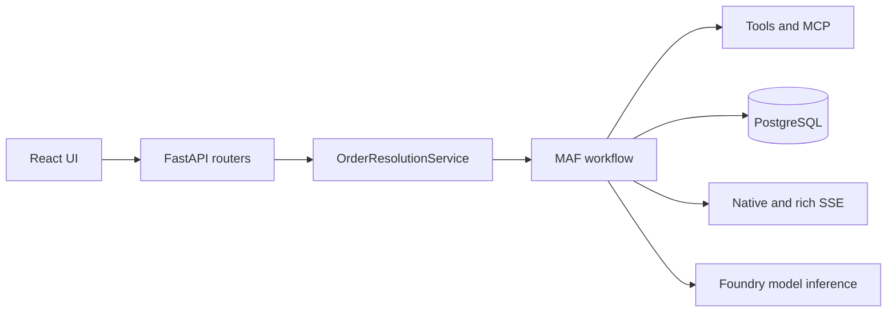

# Order Resolution Agent Codebase Review

## Current architecture

The React frontend calls the FastAPI application, which invokes
`OrderResolutionService` and the MAF workflow. PostgreSQL persists runs, events, sessions, checkpoints, and approvals. SSE
projects the native event stream to the UI; `/rich` is additive native-rich
output, while `/ag-ui` and CopilotKit are separately additive redacted
selected-thread projections.

FastAPI is the sole application host. Foundry integration is a model client and
report-only evaluation capability, not a workflow host.

## Boundaries

| Area | Responsibility |
| --- | --- |
| `backend/app/api/v1/*` | HTTP and SSE contracts |
| `backend/app/modules/order_resolution/*` | Application service, domain seams, projections |
| `backend/app/maf/*` | Prompts, agents, executors, tools, runner, workflow |
| `backend/app/infrastructure/*` | Persistence and external adapters |
| `backend/app/core/*` | Configuration, database, telemetry, composition |

`agui.py` is an allowlist boundary, not a generic event serializer. It may
project only an existing durable thread and cannot pass raw rich/native payloads
to the assistant UI. `frontend/src/config.ts` resolves deployed runtime
endpoints, while `frontend/src/copilot.ts` holds the safe context allowlist and
the inspector remains disabled.

## Current risks to address separately

- API authentication and authorization are not part of the current POC contract.
- Keep service and persistence types independent of API schemas.
- Preserve deterministic HITL coverage for low-risk, high-risk, resume, reject,
  and duplicate-response scenarios.
- Preserve normal app-only release behavior and PostgreSQL identity. Bicep
  reconciliation requires explicit reviewed approval and fresh release
  smoke/E2E/evaluation/telemetry correlation evidence before a deployment
  statement.
