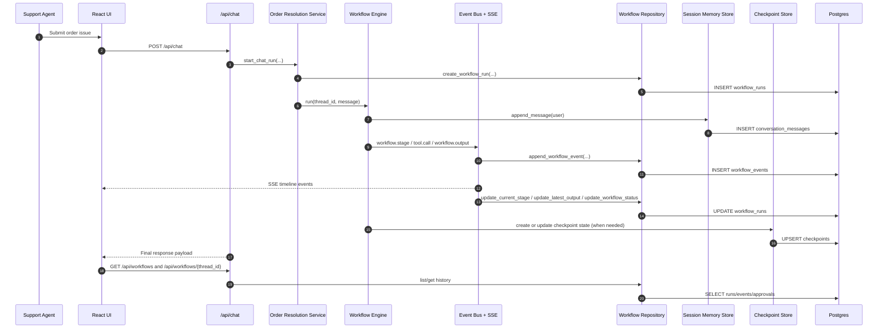

# User Flow

## Delivery Journey and Status

The product journey is:

1. Local MAF runtime (current default)
2. Foundry-hosted runtime (private VNet lane retained)

Current status:

| Stage | Status | What is actually wired today |
| --- | --- | --- |
| Local MAF | Implemented | FastAPI composes the shared workflow directly from `backend/app/maf/workflows/order_resolution.py`. |
| Foundry-hosted | Implemented | Responses-native hosted entrypoint runs the same shared MAF workflow. |
| Private web path | Implemented and protected-release verified | External frontend ACA proxies same-origin API/SSE requests to the internal FastAPI wrapper, which dispatches to private Foundry Responses and replays persisted PostgreSQL events. |
| Selected-thread AG-UI/CopilotKit UI | Implemented, locally validated, and release-evidenced | Optional read-only views consume an allowlisted durable-event projection for one existing thread without changing the native timeline or HITL controls. |

Operational status note (2026-07-18):

- Private Foundry lane remains the only hosted lane tracked for this branch.

## Current Runtime User Flow (Implemented Path)

1. User enters an order issue in UI and submits.
2. UI starts SSE stream for the active thread.
3. Backend executes sequential stages:
   - Triage agent extracts order and issue type.
   - Policy retrieval stage performs local pgvector-compatible RAG lookup and records evidence IDs.
   - Policy agent calls tools and MCP lookup.
   - Resolution agent decides action and HITL requirement.
4. If HITL required:
   - Backend emits `checkpoint.created` and `hitl.request`.
   - UI shows approval panel.
5. Reviewer approves/rejects via UI.
6. Backend resumes from checkpoint and emits `workflow.output`.
7. UI appends final output and keeps thread available for follow-up turns.

For Foundry-hosted conversations, the same behavior is preserved through Responses turns in the same `conversation_id`, including explanation follow-ups such as “Why was that resolution selected?”.

If the same approval/rejection request is accidentally submitted more than once for a checkpoint, backend handling is idempotent and does not emit duplicate terminal events.

## Private VNet browser path

In the hosted private lane, the external React/Nginx frontend uses a same-origin
`/api` proxy to the internal FastAPI Container App. The backend creates the
Foundry Responses conversation with managed identity, and the hosted MAF agent
persists workflow events/checkpoints in PostgreSQL. The frontend polls a newly
created conversation until its durable projection is available, then consumes
the unchanged native SSE events. Browser runtime configuration contains no
backend or Foundry endpoint; only the internal wrapper reaches private data
planes. The Container Apps environment remains VNet-integrated on its dedicated
subnet; it does not reuse the Foundry agent-host subnet.

## Optional selected-thread flow

The selected-thread design is additive and is not a second workflow path:

1. The operator starts, selects, or reopens an existing workflow thread using
   the existing native timeline and durable-history APIs.
2. An optional AG-UI view may request
   `GET /api/chat/stream/{thread_id}/ag-ui`. A CopilotKit view first discovers
   static metadata at `GET /api/copilotkit/info` (or `GET /api/copilotkit`),
   then posts the selected existing `threadId` to `POST /api/copilotkit`.
3. The internal wrapper reads/tails the durable projection and returns only
   allowlisted lifecycle labels, safe tool labels, validated checkpoint IDs and
   approval decisions, and generic terminal/error text.
4. Supplied compatibility fields (`runId`, `messages`, `state`, `tools`,
   `context`, and `forwardedProps`) are discarded. The projection cannot start,
   resume, approve, reject, or otherwise mutate the workflow.
5. If either optional view is unavailable, malformed, or disconnected, the
   operator continues with the native SSE timeline, workflow history, and HITL
   controls.

The browser receives no order/customer or policy data, MCP/RAG content, tool
arguments/results, prompts, raw model output, checkpoint payloads, reviewer
comments, credentials, or secrets from these views. CopilotKit in this design
means `@copilotkit/react-core`, not the GitHub Copilot SDK.

The private frontend implementation and its strict typecheck, lint, build, and
focused Playwright coverage are complete and locally validated: 128 tests
passed, the deterministic evaluation completed 10/10, seven workflow and four
selected-thread E2E cases passed, and design review passed. The protected
`vm-maffnd-runner` release evidence is recorded in
[issues-changes-fixes.md](issues-changes-fixes.md#app-only-release-evidence-2026-08-07);
the local gates remain separate from that hosted proof.

## End-to-End Happy Path (UI -> API -> Backend -> Postgres)

Mermaid:



ASCII fallback:

```text
Support Agent
   |
   v
React UI (frontend/src/App.tsx, components/*)
   | POST /api/chat
   v
FastAPI Chat API (backend/app/api/v1/routers/chat.py)
   |
   v
Order Resolution Service (backend/app/modules/order_resolution/service.py)
   |
   v
Workflow Runtime (backend/app/maf/workflows/order_resolution.py)
   |-- write transcript --> Session Memory Store (backend/app/infrastructure/persistence/session_memory.py)
   |                         -> Postgres table: conversation_messages
   |
   |-- emit events -------> Event Bus (backend/app/infrastructure/events/event_bus.py)
      |                         -> projector (backend/app/modules/order_resolution/projections.py)
   |                         -> repository (backend/app/infrastructure/persistence/workflow_run_repository.py)
   |                         -> Postgres tables: workflow_runs, workflow_events, approvals
   |
   |-- checkpoint state --> Checkpoint Store (backend/app/infrastructure/persistence/checkpoint_store.py)
   |                         -> Postgres table: checkpoints
   |
   +-- final output ------> API response + SSE stream to UI timeline

History views:
UI -> GET /api/workflows, /api/workflows/{thread_id}, /api/sessions/{session_id}/messages
   -> backend/app/api/v1/routers/workflows.py + backend/app/api/v1/routers/sessions.py
   -> backend/app/infrastructure/persistence/workflow_run_repository.py
   -> Postgres read models
```

Primary file touchpoints in this path:

- UI: `frontend/src/App.tsx`, `frontend/src/components/*`
- API: `backend/app/api/v1/routers/chat.py`, `backend/app/api/v1/routers/workflows.py`, `backend/app/api/v1/routers/sessions.py`
- API schemas: `backend/app/api/v1/schemas/*`
- Service facade: `backend/app/modules/order_resolution/service.py`
- Runtime wiring: `backend/app/core/container.py`
- Event projection: `backend/app/modules/order_resolution/projections.py`
- Workflow logic: `backend/app/maf/workflows/order_resolution.py`
- Persistence adapters: `backend/app/infrastructure/persistence/*`
- Schema: `backend/app/sql/schema.sql`

### Event Contract (must stay stable for frontend/tests)

- `workflow.stage`
- `tool.call`
- `checkpoint.created`
- `hitl.request`
- `hitl.response`
- `workflow.output`

## Policy Evidence IDs

- The existing `tool.call` event now includes `policy_evidence_ids` (chunk IDs from retrieval) and `policy_retrieval` metadata (`provider`, `query_id`, `count`).
- Event type contracts are unchanged.
- The stable SSE stream remains the primary contract. A parallel rich stream at
  `/api/chat/stream/{thread_id}/rich` remains additive for compatible
  consumers; it is not the approved redacted selected-thread assistant
  surface. The dedicated `/ag-ui` and CopilotKit contracts above must remain
  optional and privacy-safe.

## API Pagination Contracts

- Workflow history: `GET /api/workflows?page=<n>&page_size=<n>` (legacy `pageSize` remains supported).
- Workflow timeline events: `GET /api/workflows/{thread_id}/events?limit=<n>&cursor=<token>`.
- Session transcript messages: `GET /api/sessions/{session_id}/messages?limit=<n>&cursor=<id>`.

## HITL Test Reference

For exact conditions that trigger human approval and ready-to-run test scenarios, see:

- `hitl-approval-conditions.md`
- `engineering-operating-model.md`
