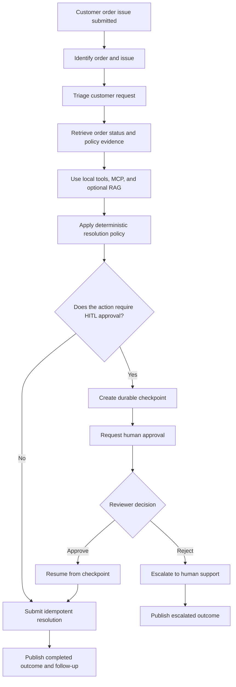
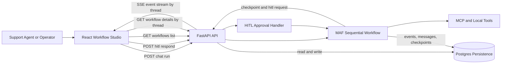
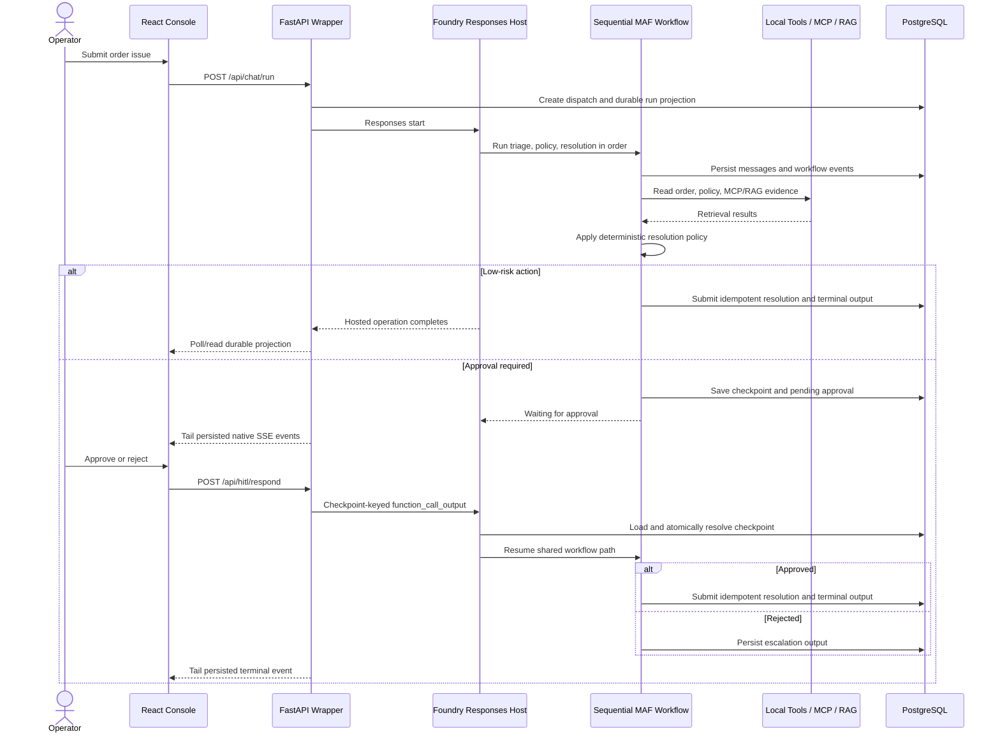
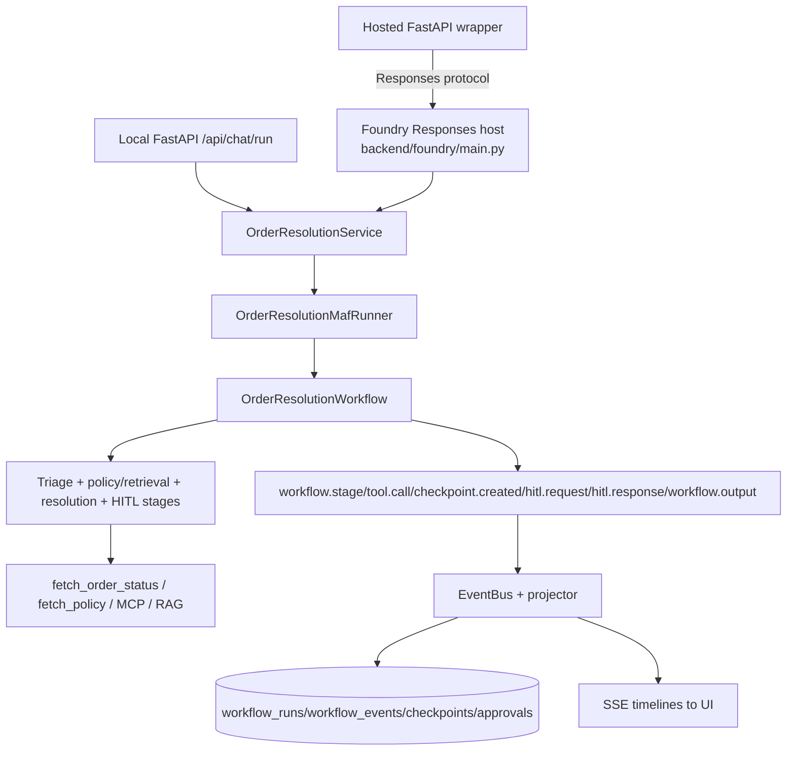
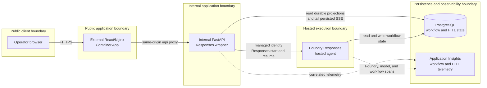

# Architecture: Order Resolution Workflow

## Purpose

This document uses the **4+1 architectural view model**:

1. **Logical view** defines the business decision path and responsibility
   boundaries.
2. **Process view** defines runtime sequencing, HITL pause/resume, and
   cross-process behavior.
3. **Development view** maps those responsibilities to source modules and
   browser/API contracts.
4. **Physical view** defines the deployed network, identity, and durable-store
   boundaries.
5. **Scenarios (+1)** prove the architecture through low-risk completion,
   approval, rejection, recovery, and privacy-safe operator flows.

It is the design map for the sequential MAF workflow, durable approval
boundary, browser/API contract, and public Foundry-hosted lane.

Repository configuration and source code describe implementation intent. They
are not evidence of a currently live endpoint, deployment, trace, or
evaluation result. Recorded release evidence belongs in
[issues-changes-fixes.md](issues-changes-fixes.md).

## Business Problem

Support teams need to resolve delivery and product issues quickly while keeping
risky actions, such as refunds and sensitive resolutions, under explicit human
control. The system must:

- automate common low-risk cases;
- require a human decision for defined high-risk cases;
- retain the run, event, transcript, checkpoint, and approval history needed
  to explain what happened; and
- present operators with a stable, observable timeline without giving the
  browser credentials for internal services.

## Project Goal

Deliver a verifiable order-resolution workflow that is:

- **sequential:** one MAF business path progresses through triage, policy
  retrieval (local policy, MCP, and RAG), and resolution;
- **decision-safe:** HITL conditions are deterministic and a durable
  checkpoint explicitly gates approval, rejection, and resume;
- **durable:** PostgreSQL owns application workflow state and audit
  projections across process restarts;
- **contract-preserving:** native SSE remains the stable browser contract,
  while AG-UI and CopilotKit are additive selected-thread views; and
- **release-governed:** a public hosted release is claimed only from recorded
  smoke, E2E, evaluation, and telemetry evidence.

## Logical View

The logical view follows one customer issue from intake through ordered
assessment, deterministic resolution policy, and either automatic completion
or an explicit human decision.



### Logical Runtime Boundaries

The same logical decision path is implemented as a sequential MAF workflow;
the following view shows the responsibility boundaries, not a second business
flow.



### Business Decision Model

1. **Triage** records a concise order/issue summary. When Foundry model
   settings are present, the MAF `SequentialBuilder` runs its triage, policy,
   and resolution participants in order and emits observable MAF stream
   signals. If those model settings are absent, the triage summary is
   deterministic, but it remains inside the same workflow rather than
   selecting a second orchestration path.
2. **Policy, MCP, and RAG retrieval** derives the order ID and issue type,
   reads the local order/policy tools, queries the configured RAG provider, and
   calls the MCP knowledge port. The composition currently wires the
   `NoopRAGProvider`; the architecture permits a provider behind that port but
   does not claim that an external retrieval service is live.
3. **Resolution** deterministically chooses an action and checks whether it
   requires approval. The trigger rules are amount/risk of at least `100`,
   damaged item, or `manual_review` policy. The exact conditions and test
   inputs are maintained in
   [hitl-approval-conditions.md](hitl-approval-conditions.md).
4. **Completion or human decision** submits the low-risk action once, or
   creates a durable HITL checkpoint before any gated action completes.

The model can help summarize or explain the case, but it does not replace the
deterministic policy and HITL decision.

### Logical Boundaries

- The UI can start a run, read its durable history, consume native SSE, and
  submit a human decision. It does not invoke Foundry or PostgreSQL directly.
- The application service creates a run in local mode or delegates the
  browser request to Foundry Responses in wrapper mode; it does not create a
  second business workflow.
- MAF owns ordered workflow behavior and stage telemetry.
- Infrastructure adapters own PostgreSQL, MCP, RAG, and Foundry Responses
  access behind ports.
- PostgreSQL is the application-owned source of durable workflow/audit state;
  the Foundry conversation is a separate Foundry-managed conversation identity.

## Process View

The process view describes the runtime interactions, durable handoff, and
approval/resume behavior for a public hosted request.



### Local Order-Resolution Flow

1. The browser calls `POST /api/chat/run` with a message and optional
   thread/session identifiers.
2. `OrderResolutionService` assigns IDs, creates the `workflow_runs` record,
   and starts the shared MAF workflow.
3. The workflow persists the user message, emits a `workflow.stage` for
   triage, and produces its sequential triage result.
4. Policy retrieval emits its stage events, obtains local policy/order data,
   performs RAG and MCP reads, and emits the stable `tool.call` event.
5. Resolution chooses the action and determines whether approval is required.
6. A low-risk decision performs the idempotent resolution submission, appends
   the assistant message, and emits terminal `workflow.output`.
7. A high-risk decision enters the durable HITL branch below instead of
   submitting the action.
8. The event bus publishes each native event to local subscribers and its
   projector writes the durable event/run state used by history and hosted
   wrapper streams.

### Durable HITL Pause, Decision, and Resume

The approval branch is an explicit state transition, not a transient UI
prompt:

1. The workflow creates a PostgreSQL checkpoint containing the order/action
   state, run/session identifiers, and sanitized trace context.
2. It emits `checkpoint.created`, followed by `hitl.request`, and returns in a
   waiting state. There is no resolution submission at this point.
3. An operator submits `POST /api/hitl/respond` with the checkpoint ID,
   `approve` or `reject`, reviewer, and optional comment.
4. The checkpoint store loads the checkpoint and atomically resolves the
   pending checkpoint. A duplicate response is not a second approval or
   resolution.
5. On **approve**, the workflow resumes from the checkpoint context, records
   `hitl.response`, submits the resolution through its idempotency key, and
   emits `workflow.output` with `completed`.
6. On **reject**, it records `hitl.response`, appends the rejection
   transcript entry, and emits an `escalated` `workflow.output`; it does not
   submit the proposed resolution.

The persisted checkpoint trace context becomes the parent of the resume span,
so the approval and final outcome can correlate with the original pause.

### Public Hosted Request and Resume Flow

The intended public topology preserves the browser contract while separating
the public UI from both the internal API and Foundry:

```text
Browser
  -> external React/Nginx Container App
  -> same-origin /api proxy
  -> internal FastAPI responses-wrapper Container App
  -> managed-identity Foundry Responses endpoint
  -> hosted MAF workflow
  -> shared PostgreSQL workflow/checkpoint/event state
```

For an initial wrapper request:

1. The wrapper records a request-hash/idempotency entry in
   `responses_dispatches`.
2. Its `ResponsesWorkflowClient` creates a Foundry `conv_...` conversation
   before dispatching the first Responses request and returns that conversation
   ID as the browser-visible thread.
3. The hosted `backend/foundry/main.py` Responses entrypoint runs the shared
   workflow using that conversation/thread ID and writes durable projections.
4. Initial dispatch is non-streaming. While the hosted agent produces the
   durable projection, the UI can poll its selected thread and subscribe to
   SSE.

For an approval or rejection, the wrapper looks up the pending durable approval
and sends a checkpoint-keyed `function_call_output` in the same Foundry
conversation. The hosted entrypoint parses the decision and performs the
durable resume path described above.

The wrapper and hosted agent are separate processes. Consequently, wrapper
mode tails persisted `workflow_events` for native SSE instead of relying on
the local in-memory event bus.

## Development View

There is one business workflow implementation and one application service
boundary:



### Core Modules and Ownership

| Concern | Source ownership | Responsibility |
| --- | --- | --- |
| HTTP and SSE | `backend/app/api/v1/routers/*` | Stable chat, HITL, history, health, AG-UI, and CopilotKit endpoints. |
| API contracts | `backend/app/api/v1/schemas/*` | Request and response validation for chat, HITL, workflow, session, and CopilotKit interactions. |
| Application/domain | `backend/app/modules/order_resolution/*` | Service seam, workflow context/events, ports, durable event iteration, event projections, and AG-UI/CopilotKit projections. |
| Runtime composition | `backend/app/core/*` | Runtime-target configuration, Postgres/event-bus composition, and telemetry setup. |
| MAF workflow | `backend/app/maf/*` | Prompts, agents, tools, sequential triage, policy retrieval, resolution, HITL, runner, and middleware. |
| Adapters | `backend/app/infrastructure/*` | PostgreSQL repositories, checkpoint/session/idempotency stores, MCP/RAG, Foundry Responses client, and event bus. |
| Foundry host | `backend/foundry/main.py` | Responses protocol parsing, invocation tracing, and construction of the same hosted MAF path. |
| Browser UI | `frontend/src/*` | React timeline, approval panel, optional selected-thread AG-UI, and CopilotKit presentation. |

`RUNTIME_TARGET=local_maf` runs the workflow from FastAPI for local validation.
`RUNTIME_TARGET=responses_wrapper` changes FastAPI into the Responses wrapper;
it delegates start/resume to Foundry and reads durable projections. The wrapper
does not implement a hosted-only orchestrator.

### Browser and Event Contracts

The native event envelope and detailed payload conventions are defined in
[schema-io-telemetry.md](schema-io-telemetry.md). These event types are the
stable SSE contract and must not be renamed or replaced:

- `workflow.stage`
- `tool.call`
- `checkpoint.created`
- `hitl.request`
- `hitl.response`
- `workflow.output`

The principal endpoints are:

| Endpoint | Contract |
| --- | --- |
| `POST /api/chat/run` | Starts a local run or delegates the initial request to Foundry in wrapper mode. |
| `GET /api/chat/stream/{thread_id}` | Stable native SSE timeline; in wrapper mode it replays and tails persisted events. |
| `GET /api/chat/stream/{thread_id}/rich` | Additive `workflow.rich` envelope with AG-UI-compatible event mappings. |
| `GET /api/chat/stream/{thread_id}/ag-ui` | Additive, selected-thread native AG-UI SSE projection. |
| `POST /api/hitl/respond` | Resolves one durable checkpoint with approve or reject. |
| `GET /api/workflows*` and `GET /api/sessions/{session_id}/messages` | Durable workflow/event and transcript read models. |
| `GET /api/copilotkit[/info]`, `POST /api/copilotkit` | Discovery and read-only selected-thread CopilotKit bridge. |

### AG-UI and CopilotKit

AG-UI and CopilotKit are optional, additive views. They never replace native
SSE, durable history endpoints, or the order-resolution workflow:

- The selected-thread native AG-UI endpoint and the CopilotKit bridge read and
  tail persisted events, which keeps them usable when wrapper and hosted
  processes are separate.
- The CopilotKit bridge validates that a thread exists, does not start work or
  consume caller-provided messages/tools, and exposes generic lifecycle
  events, allowlisted step/tool labels, validated checkpoint IDs/decisions,
  and generic terminal text.
- The React CopilotKit context is limited to selected thread ID, normalized
  status, event type/timestamp, pending-approval count, and output presence.
  This is CopilotKit (`@copilotkit/react-core`), not the GitHub Copilot SDK.

The dedicated AG-UI and CopilotKit projections are redacted. In contrast, the
current native SSE serializer emits the persisted native event, and the
current `/rich` envelope includes `native_event`/`rawEvent` plus mapped event
content. Since the workflow's `tool.call` payload can contain MCP/RAG
retrieval data, neither native SSE nor `/rich` should be treated as an
approved surface for raw MCP, RAG, order, policy, prompt, checkpoint, or
credential data without an explicit redaction change. The required privacy
boundary is that such data remains backend-only; only the dedicated
allowlisted projections currently enforce that boundary in code.

## Physical View

### Hosted Execution Boundary

The public design is:



The browser never receives a Foundry endpoint credential, Foundry access
token, or database credential. The internal wrapper uses managed identity for
the Foundry data-plane request. The hosted service uses its runtime database
configuration; no direct browser-to-Foundry or browser-to-PostgreSQL path is
part of this design.

### Durable Stores and Recovery

PostgreSQL is the durable application store:

| Store | Purpose |
| --- | --- |
| `workflow_runs` | Per-thread status, summarized input, current stage, timing, and latest output. |
| `workflow_events` | Append-only ordered native timeline used by history and durable SSE. |
| `conversation_messages` and `sessions` | Thread transcript and session association. |
| `checkpoints` and `approvals` | Durable HITL state, reviewer decision, comments, and audit timestamps. |
| `idempotency_keys` | One-time resolution submission protection. |
| `responses_dispatches` | Wrapper request-hash/idempotency lifecycle and resolved Foundry conversation thread. |
| `eval_runs` and `eval_results` | Local evaluation records. |

Read/model operations have bounded retry behavior. The resolution submission
is side-effecting and is protected by the workflow-run/step/business
idempotency record instead of a blind retry. Event insertion is also
idempotent by event ID. These properties let a restart or repeated approval
request recover from durable state without repeating the resolution.

## Observability, Traces, and Privacy

Telemetry uses OpenTelemetry/MAF instrumentation and exports to Azure Monitor
Application Insights when `APPLICATIONINSIGHTS_CONNECTION_STRING` is
configured. The intended signal includes:

- `foundry.responses.invoke` for hosted Responses turns;
- `workflow.run`, stage spans, `workflow.hitl_waiting`,
  `workflow.hitl_resume`, and `workflow.resolution_submit`;
- MAF streamed `executor_invoked`, `executor_completed`, and `output`
  observations; and
- correlation attributes such as thread, run, session, checkpoint, status,
  and Foundry conversation IDs.

FastAPI health and chat-SSE request spans are intentionally excluded in the
public lane so probes and long-lived streams do not dominate request
telemetry. The business workflow, Foundry invocation/model, and HITL spans
remain the operational signal. `OTEL_RECORD_CONTENT=false` is the default;
content recording is an explicit configuration choice. The schema document
contains the telemetry conventions and operational query example:
[schema-io-telemetry.md](schema-io-telemetry.md).

Foundry trace evaluation requires the supported project-scoped Application
Insights connection. Release validation must wait for the configured trace age
and evaluate the fresh hosted E2E conversations; source configuration alone is
not trace evidence.

## Scenarios (+1 View)

The scenario view demonstrates how the four structural views work together.
Each scenario uses the same sequential business workflow and durable
PostgreSQL projections; it does not introduce a separate orchestration path.

| Scenario | Logical decision | Process and recovery behavior | Observable/operator outcome |
| --- | --- | --- | --- |
| `ORD-1001` low-risk late delivery | Policy permits an automatic resolution. | Triage, retrieval, and resolution complete in order; idempotent submission writes one terminal result. | Native SSE ends with `workflow.output`; durable history shows `completed` with no `hitl.request`. |
| `ORD-1009` high-amount delay, approved | Deterministic threshold requires a partial-refund approval. | The workflow saves a checkpoint, pauses, then resumes from the checkpoint after one approval; repeated approval is idempotent. | Timeline shows `checkpoint.created`, `hitl.request`, `hitl.response`, and terminal `workflow.output`; traces correlate wait and resume. |
| Damaged item, rejected | Damaged-item policy requires human review; the reviewer rejects the proposed action. | The checkpoint resolves once and the workflow records rejection without invoking the side-effecting resolution submission. | Durable event history ends in `escalated`; the approval audit identifies the reviewer and decision. |
| Hosted wrapper restart or reconnect | The browser request remains tied to one Foundry conversation/thread and durable run state. | The wrapper replays/tails `workflow_events` from PostgreSQL rather than depending on an in-memory event bus. | The operator can reload history and native SSE without duplicate dispatch or loss of a pending approval. |
| Selected-thread assistance | The assistant may explain lifecycle state but cannot decide or perform a resolution. | AG-UI and CopilotKit read the persisted, allowlisted projection only. | The UI receives safe labels, status, checkpoint summaries, and generic output; raw order/policy/MCP/RAG/checkpoint data remains server-side. |

## Execution Surfaces and Release Behavior

The supported execution surfaces are:

1. **Local full stack:** React, FastAPI, native SSE, and PostgreSQL, used for
   authoritative UI/API/event-contract validation.
2. **Public Foundry hosted agent:** `backend/foundry/main.py` packaged by
   `backend/Dockerfile.hosted`, serving the Responses protocol.
3. **Public browser path:** external frontend Container App, internal FastAPI
   wrapper Container App, Foundry Responses, and shared PostgreSQL durable
   state.

GitHub Actions is credential-free CI only. Authenticated public release runs
from an operator workstation through:

```bash
AZURE_SUBSCRIPTION_ID="<subscription>" \
RUNTIME_DATABASE_URL="postgresql://...?...sslmode=require" \
make foundry-release
```

The automatic route is **app-only**: it selects quick or full validation, runs
the Bicep build, packages/deploys the approved backend, frontend, and hosted
agent application legs, then runs smoke, hosted E2E, trace evaluation, and
Application Insights verification. It reuses the existing PostgreSQL database
and does not automatically provision infrastructure.

Provisioning is a separate exception. `make foundry-provision` refuses to run
without both `FOUNDRY_INFRA_RECONCILIATION_APPROVED=true` and a non-secret
`FOUNDRY_INFRA_RECONCILIATION_REFERENCE` after a reviewed preview. The exact
release DAG, ownership boundary, and proof template are in
[.azure/deployment-plan.md](../../.azure/deployment-plan.md) and
[engineering-operating-model.md](engineering-operating-model.md).

## Verification

| Concern | Evidence and command |
| --- | --- |
| Sequential low-risk and durable HITL behavior | `make test` |
| Deterministic workflow contract cases | `make eval-backend` |
| Browser native-SSE, approval, and selected-thread behavior | `make test-e2e` |
| Hosted/runtime report-only evaluation | `make eval-foundry` |
| Consolidated local design/review gate | `./scripts/skills/design-review-skill.sh` |
| Hosted release proof | `make foundry-release`, then record dated non-secret evidence in `issues-changes-fixes.md` |

Baseline scenarios are `ORD-1001` (low risk, no HITL), `ORD-1009` (high
amount, HITL), and a damaged-item message (HITL). A release-ready claim
requires the recorded hosted smoke/E2E, Foundry evaluation, and Application
Insights correlation evidence described in the engineering operating model; it
must not be inferred from this document or source configuration.
