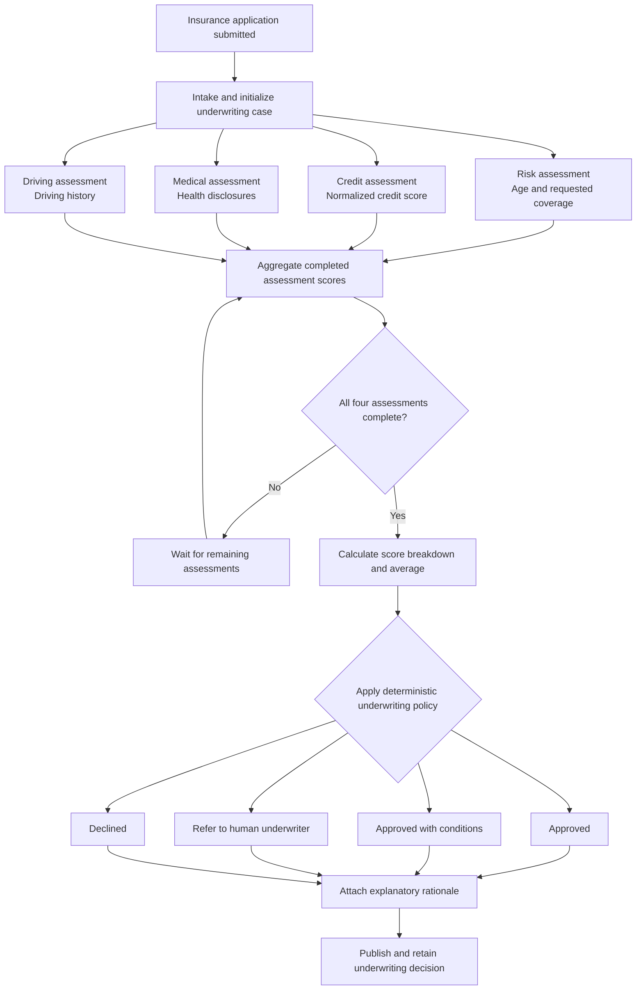
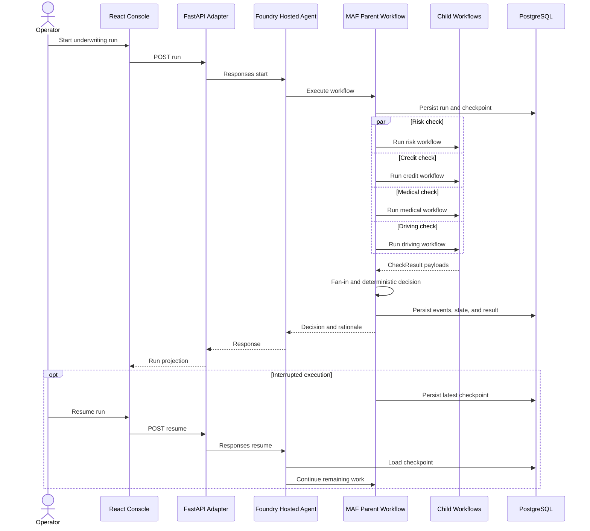
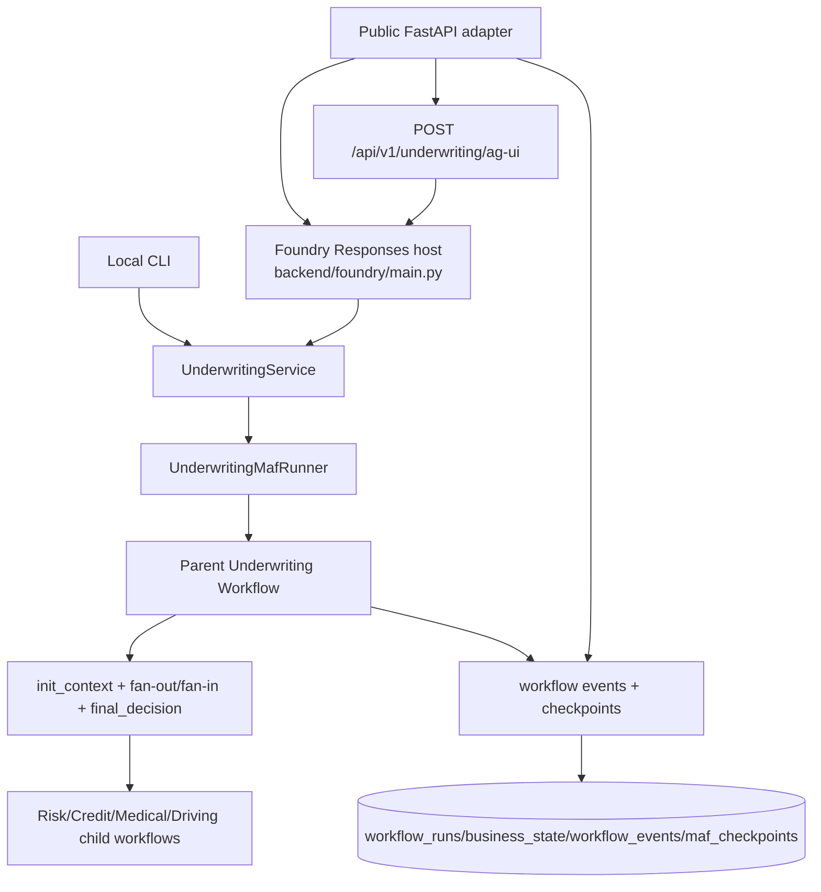
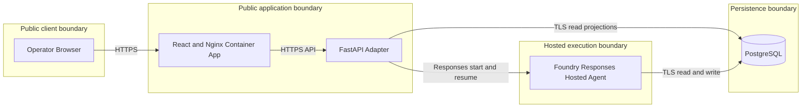

# Architecture: Underwriting Workflow

## Purpose

This document describes the business and runtime architecture for the underwriting use case through four views: logical, process, development, and physical. It also records the clean-cutover operating model for the public hosted lane.

For the rationale behind the initial Underwriting design and the later clean
alignment decisions, see [architecture-decisions.md](architecture-decisions.md).

## Business Problem

Insurance teams need to process applications quickly while keeping decisions explainable, durable, and safe under infrastructure or runtime failures. The system must:

- automate low-risk applications,
- surface high-risk applications with transparent score factors and rationale,
- preserve complete run history and state transitions,
- recover from crashes without duplicating side effects.

## Project Goal

Deliver a verifiable multi-step underwriting workflow that is:

- operationally transparent (run history, event timeline, checkpoints, AG-UI stream),
- decision-safe (deterministic score policy before any model rationale),
- durable (PostgreSQL-backed checkpoints and business projections),
- extensible (shared domain contracts across local validation, the public adapter, and the hosted agent),
- release-governed (hosted readiness is claimed only from recorded smoke/E2E/eval/telemetry evidence).

## Logical View

The logical view follows an insurance application from intake through parallel assessments, aggregation, and the final underwriting outcome.

### Business Decision Model

- Intake creates one underwriting case for the submitted application.
- Risk, credit, medical, and driving assessments run independently and may complete in any order.
- Aggregation proceeds incrementally, but no decision is made until all four assessment results are present.
- The deterministic policy approves when the average score is at least `0.8`, risk is at least `0.6`, and credit is at least `0.65`. Lower average-score bands produce approval with conditions, human referral, or decline.
- Model-generated rationale explains the result but cannot change the policy decision.

## Process View

The process view describes runtime interactions, concurrency, persistence, and recovery behavior.

### Underwriting Message Flow

1. `init_context` initializes shared workflow state and emits one check request per required domain.
2. Parent fans out to child workflows through `WorkflowExecutor`.
3. Each child emits one `CheckResult` payload.
4. `fan_in_aggregator` incrementally merges child results into shared state.
5. When all checks complete, `final_decision` computes policy outcome and score breakdown.
6. Rationale generation enriches the final payload while deterministic decision remains authoritative.
7. Projection and checkpoint stores persist results for history and resume behavior.

### Failure and Recovery

- Middleware wraps check operations with retry/backoff behavior.
- Crash injection can force controlled interruptions after a named executor.
- Resume loads the latest checkpoint by `workflow_run_id` and continues remaining execution.
- Idempotency guards prevent duplicate persistence when replay or resume re-enters completed handlers.

## Development View

The development view maps runtime responsibilities to source modules and verification surfaces.

There is one business workflow implementation and one service boundary (`backend/app/modules/underwriting/service.py`).

- `backend/app/main.py` and CLI commands invoke the same service/workflow path for local verification runs.
- `backend/app/server.py` exposes HTTP routes for run/resume/history/state/events/checkpoints.
- `backend/app/server.py` also adds `POST /api/v1/underwriting/ag-ui` for AG-UI event streaming.
- `backend/app/modules/underwriting/service.py:UnderwritingHostedAdapter` relays start/resume operations and projects the shared durable history; it does not construct a second production orchestration path in hosted mode.
- `backend/foundry/main.py` hosts the real Foundry Responses workflow entrypoint and constructs the MAF runner there.

### Core Modules

- **Application layer** (`backend/app/modules/underwriting`)
  - Orchestration service boundary and domain decision modeling.
- **Workflow runtime** (`backend/app/maf`)
  - Parent/child workflows, fan-out/fan-in executors, middleware, and AG-UI adapters.
- **Persistence adapters** (`backend/app/infrastructure`)
  - PostgreSQL repositories for runs, state, events, results, and idempotency.
  - Real MAF checkpoint storage through `PostgresCheckpointStorage`.
- **Frontend** (`frontend/src`)
  - Operations console for scenario execution, live progress stream, and run-history inspection.
  - Embedded CopilotKit assistant receives only an allowlisted selected-run projection through the public adapter.

### Execution Surfaces

The same underwriting business flow runs across:

1. Local CLI (`make run`, `make run-crash`, `make resume`).
2. Local FastAPI routes (`/api/v1/underwriting/*`) and AG-UI stream endpoint.
3. Foundry hosted Responses workflow execution correlated to the public request and durable run.

### Clean cutover and no-shims rule

The public hosted lane adopts Order Resolution's operating model:

- the browser-facing adapter starts or resumes hosted work and reads durable projections;
- the hosted Responses entrypoint owns production orchestration and writes;
- local execution mode exists only for isolated validation;
- no compatibility shim should reintroduce a second orchestration runtime, shadow checkpoint path, or direct browser-to-Foundry flow.

### Verification

1. Functional tests (`backend/tests`) validate fan-out/fan-in, idempotency, and resume behavior.
2. E2E rubric (`frontend/tests/e2e/rubric.ts`) validates operator-facing lifecycle and recovery expectations.
3. Hosted smoke/eval (`make foundry-smoke`, `make foundry-eval`, `make foundry-trace-eval`) validates real hosted workflow/model telemetry and public-request correlation.
4. Release governance and execution evidence are recorded in [`engineering-operating-model.md`](engineering-operating-model.md) and [`issues-changes-fixes.md`](issues-changes-fixes.md).

## Physical View

The physical view describes the deployed topology, network boundaries, and credential ownership.

The public adapter passes start/resume input to the hosted agent only in the Responses body; it never places application data in Responses metadata. The browser never receives a Foundry or database credential and never calls Foundry directly. The hosted runtime alone receives its TLS database URL.

### Durable Stores

PostgreSQL is the durable source of truth for both business and workflow recovery surfaces:

- `maf_checkpoints`: serialized MAF checkpoint payloads.
- `workflow_runs`: run lifecycle summary and status.
- `business_state`: projection of incremental workflow state.
- `workflow_events`: append-only timeline for observability.
- `underwriting_results`: terminal decision outputs.
- `idempotency_records`: replay protection for side-effect safety.

### Hosted Execution Boundary

The hosted runtime uses a dedicated least-privilege PostgreSQL password over TLS. Password authentication and the narrow required network posture are release-managed and injected only into the hosted runtime. This prototype intentionally keeps the public adapter as a browser-facing relay while the hosted agent owns durable execution.

`UNDERWRITING_EXECUTION_MODE=local` exists only for isolated local E2E validation. It is never the intended deployed public-adapter mode.
