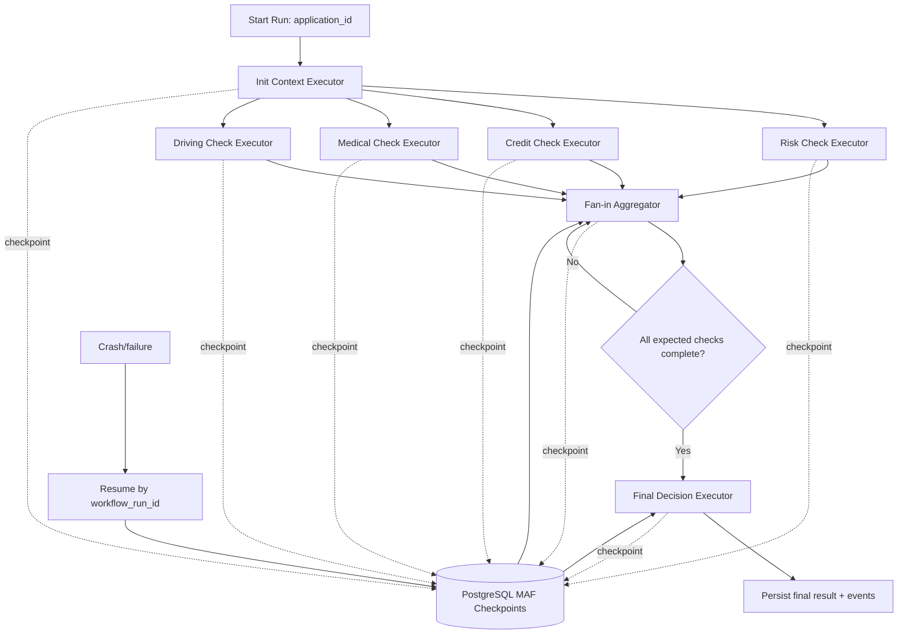
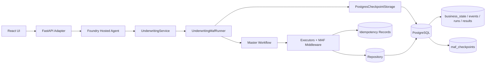

# Customer Q&A: Workflow Checkpointing, Fan-in, Context, Resilience, and Release Governance

This document summarizes how the **underwriting MAF prototype** answers customer questions and how behavior aligns with Microsoft Agent Framework documentation and samples.

## References

Microsoft Agent Framework docs and samples:

- Microsoft Agent Framework Workflows overview:  
  https://learn.microsoft.com/en-us/agent-framework/workflows/
- Microsoft Agent Framework Workflow checkpoints:  
  https://learn.microsoft.com/en-us/agent-framework/workflows/checkpoints
- Microsoft Agent Framework Workflow edges / fan-in / fan-out:  
  https://learn.microsoft.com/en-us/agent-framework/workflows/edges
- Microsoft Agent Framework Python getting-started sample:  
  https://github.com/microsoft/agent-framework/tree/main/python/samples/getting_started
- Microsoft Agent Framework repo:  
  https://github.com/microsoft/agent-framework

Prototype repo references:

- Main repo:  
  https://github.com/ppenumatsa1/maf-underwriting-agent
- Custom PostgreSQL checkpoint storage:  
  https://github.com/ppenumatsa1/maf-underwriting-agent/blob/main/backend/app/infrastructure/checkpointing/postgres_checkpoint_storage.py
- Master underwriting workflow and direct executors:
  https://github.com/ppenumatsa1/maf-underwriting-agent/tree/main/backend/app/maf/workflows
- Fan-in aggregator:  
  https://github.com/ppenumatsa1/maf-underwriting-agent/blob/main/backend/app/maf/executors/fan_in_aggregator.py
- Retry/backoff/idempotency middleware:  
  https://github.com/ppenumatsa1/maf-underwriting-agent/blob/main/backend/app/maf/middleware/resilience.py
- Resume test:  
  https://github.com/ppenumatsa1/maf-underwriting-agent/blob/main/backend/tests/test_resume.py
- Fan-in test:  
  https://github.com/ppenumatsa1/maf-underwriting-agent/blob/main/backend/tests/test_fan_in.py
- MAF runner (per-build dependency creation):  
  https://github.com/ppenumatsa1/maf-underwriting-agent/blob/main/backend/app/maf/runner.py
- State-isolation regression test:  
  https://github.com/ppenumatsa1/maf-underwriting-agent/blob/main/backend/tests/test_state_isolation.py

---

## Scope and intent

- Scope: local-first prototype with a public operations console, Application Insights telemetry, and a Foundry hosted durable-execution lane.
- Engine: real Microsoft Agent Framework workflow runtime.
- Persistence: PostgreSQL for app/audit data and custom PostgreSQL-backed MAF checkpoint storage.
- Hosting: the Foundry hosted agent is the production durable executor. The public API relays browser requests and projects durable PostgreSQL data.
- Delivery governance: underwriting now follows the same engineering operating model as Order Resolution — one canonical hosted public lane, no compatibility shims, and evidence-driven release claims in `docs/design/issues-changes-fixes.md`.
- Durable Extension: not used in this prototype.

---

## Microsoft grounding

Microsoft describes Agent Framework workflows as explicit business-process orchestration using **executors** and **edges**. Workflows are useful when a process needs controlled execution, parallelism, checkpointing, recovery, and observability.

Docs:  
https://learn.microsoft.com/en-us/agent-framework/workflows/

Microsoft checkpointing docs state checkpoints save workflow state and support resume/recovery for long-running workflows. Checkpoints are created at superstep boundaries and capture:

- executor state
- pending messages
- pending requests/responses
- shared state

Docs:  
https://learn.microsoft.com/en-us/agent-framework/workflows/checkpoints

For Python, Microsoft documents `CheckpointStorage` providers such as:

- `InMemoryCheckpointStorage`
- `FileCheckpointStorage`
- `CosmosCheckpointStorage`

All implement the same storage protocol, allowing storage backends to be swapped without changing workflow/executor logic.

Docs:  
https://learn.microsoft.com/en-us/agent-framework/workflows/checkpoints

Our prototype follows that model via custom `PostgresCheckpointStorage`.

Prototype implementation:  
https://github.com/ppenumatsa1/maf-underwriting-agent/blob/main/backend/app/infrastructure/checkpointing/postgres_checkpoint_storage.py

---

## 1. Business flow (what happens in a run)

1. Intake insurance application and initialize central underwriting context.
2. Fan out to checks: risk, credit, medical, driving.
3. Each check emits messages and writes idempotent results.
4. Fan-in aggregator handles results **one at a time** and updates shared state.
5. When all required checks are present, final decision executes.
6. Decision and events are persisted; checkpoints are saved throughout.
7. If crash occurs, resume loads latest checkpoint and continues without duplicating completed idempotent work.

### Business flow diagram (Mermaid)

---

## 2. Architecture (how components map to concerns)

---

## 3. Aggregated answers to customer questions

### 3.1 Workflow checkpointing, direct executors, and recovery

- Resume is **master-run driven** by `workflow_run_id`; the app loads the latest supported checkpoint for that run and resumes execution.
  Docs: https://learn.microsoft.com/en-us/agent-framework/workflows/checkpoints
- Risk, credit, medical, and driving executor progress is part of the master workflow state; operationally, this prototype exposes master-run resume (`make resume RUN_ID=...`).
- For multiple failed runs, checkpoint selection is isolated per `workflow_run_id` (latest checkpoint per run).
- Version-40 nested-graph checkpoints are unsupported for resume after deployment. There is no compatibility workflow or fallback: begin a new run rather than resuming a pre-cutover checkpoint.

### 3.2 Fan-in aggregation and barrier behavior

- Microsoft documents fan-in as multiple sources sending to one target via workflow edges.  
  Docs: https://learn.microsoft.com/en-us/agent-framework/workflows/edges
- In this prototype, fan-in is intentionally **incremental** (message-by-message): aggregator updates shared state and gates final decision when all expected checks are complete.
- We do not over-claim undocumented behavior for `AddFanInBarrierEdge`; we only claim what is validated by this implementation/tests.

### 3.3 Context sharing across workflow steps/tools

- Recommended programmatic pattern (used here):
  1. pass explicit message payloads for control flow, and  
  2. keep recovery-critical context in shared workflow state.
- Shared context keys in this prototype: `expected_checks`, `completed_checks`, `executor_results`, `final_decision_emitted`.
- Runtime dependency isolation is enforced per workflow build: the runner creates a fresh `PostgresCheckpointStorage` and Foundry client for each build/resume path, preventing mutable runtime objects from leaking context across runs.
- Durable business/audit state remains isolated by `workflow_run_id`; fresh runtime dependencies avoid cross-run in-memory context bleed while checkpoint/business data stay in PostgreSQL.
- Declarative workflow context sharing is not implemented in this prototype; the same principle applies (explicit inputs + durable/framework-managed state).

### 3.4 Failures, retries, backoff, timeout, and 429 handling

- Recommended layering:
  - workflow definition: orchestration and branching,
  - middleware/client wrappers: retry/backoff/429/transient handling,
  - tool/executor code: business semantics + idempotency.
- Do not assume universal automatic 429 handling for all calls; in this prototype, retry/backoff is explicit in middleware and replay safety is enforced via idempotency.
- Prototype resilience middleware:  
  https://github.com/ppenumatsa1/maf-underwriting-agent/blob/main/backend/app/maf/middleware/resilience.py

### 3.5 What does adopting Order Resolution's operating model change?

It changes **delivery governance**, not the underwriting workflow design.

- The public adapter is the browser-facing boundary.
- The hosted Responses entrypoint is the production executor.
- PostgreSQL remains the durable recovery and audit store.
- AG-UI and CopilotKit remain public surfaces backed by durable projections.
- Release readiness is claimed from recorded hosted smoke, E2E, eval, and telemetry evidence.

### 3.6 What does clean cutover / no shims mean here?

It means we fix the hosted path rather than masking issues with alternate runtime paths.

Specifically, the public lane should not introduce:

- a second orchestration engine in the adapter,
- a shadow checkpoint or history store,
- direct browser-to-Foundry traffic,
- local-only fallback behavior presented as production hosting.

---

## 4. Fan-in behavior

### Q: Does fan-in deliver one message at a time or all results as a list?

Microsoft documents fan-in as multiple executors sending messages to one target.

Docs:  
https://learn.microsoft.com/en-us/agent-framework/workflows/edges

In this prototype, fan-in is modeled as **message-by-message aggregation**:

- each direct executor emits independently
- aggregator handles each result
- aggregator updates shared state
- final decision runs only when all expected checks are complete

Important clarification:  
We do not claim `AddFanInBarrierEdge` always delivers one-message-at-a-time unless that specific API behavior is validated directly. This prototype validates incremental aggregation via explicit direct-executor-to-aggregator edges.

Prototype master workflow and direct executors:
https://github.com/ppenumatsa1/maf-underwriting-agent/tree/main/backend/app/maf/workflows

Prototype fan-in aggregator:  
https://github.com/ppenumatsa1/maf-underwriting-agent/blob/main/backend/app/maf/executors/fan_in_aggregator.py

Fan-in test:  
https://github.com/ppenumatsa1/maf-underwriting-agent/blob/main/backend/tests/test_fan_in.py

### Q: Recommended fan-in pattern today?

Use shared workflow state for aggregation (`expected_checks`, `completed_checks`, `executor_results`, `final_decision_emitted`) and trigger final decision only when all expected checks are complete.

---

## 5. Context sharing across workflow steps

### Q: How should context be shared programmatically?

Use explicit message payloads for control flow and shared workflow state for durable cross-step context. Also ensure per-run runtime dependencies are not reused across workflow builds.

Pattern used here:

1. `init_context` initializes canonical context.
2. Direct executor requests carry run/application identity.
3. Direct executor results are sent as typed messages.
4. Aggregator writes results into shared workflow state.
5. Final decision reads completed shared state.
6. Runner builds each workflow with fresh checkpoint storage/client instances so runtime context is not shared across runs.

Prototype init context:  
https://github.com/ppenumatsa1/maf-underwriting-agent/blob/main/backend/app/maf/executors/init_context.py

Prototype fan-in aggregator:  
https://github.com/ppenumatsa1/maf-underwriting-agent/blob/main/backend/app/maf/executors/fan_in_aggregator.py

Prototype runner state isolation change:  
https://github.com/ppenumatsa1/maf-underwriting-agent/blob/main/backend/app/maf/runner.py

State isolation regression test:  
https://github.com/ppenumatsa1/maf-underwriting-agent/blob/main/backend/tests/test_state_isolation.py

### Q: Declarative workflow context sharing?

Declarative workflows are not implemented in this prototype. The same rule applies: pass explicit inputs, keep recovery-critical cross-step state framework-managed or durable, and avoid ephemeral locals for decision-critical data.

---

## 6. Retry, backoff, timeout, and 429 handling

### Q: Where should retries/backoff/timeouts be implemented?

Recommended layering:

- **Workflow definition:** orchestration/routing/branching.
- **Middleware/client wrapper:** retry/backoff policy, retryable-vs-terminal classification, 429/transient handling.
- **Executor/tool code:** domain semantics, idempotency keys, side-effect safety.

Prototype middleware:  
https://github.com/ppenumatsa1/maf-underwriting-agent/blob/main/backend/app/maf/middleware/resilience.py

### Q: Does MAF automatically handle 429s everywhere?

Do not assume universal automatic handling for all model/tool/API calls. Treat 429 and transient failures as explicit reliability policy. In this prototype, retry/backoff is explicit in middleware and idempotency prevents duplicate side effects during replay/resume.

---

## 7. Durable Extension clarification

This prototype uses standard MAF workflow checkpointing with custom PostgreSQL checkpoint storage.

It does **not** use the MAF Durable Extension.

Current position:

- Standard MAF workflow runtime
- Custom PostgreSQL checkpoint storage
- Local Docker/PostgreSQL validation plus the documented public hosted lane
- No Durable Extension yet
- Hosted readiness claims depend on the current evidence recorded in `docs/design/issues-changes-fixes.md`

---

## 8. What this prototype proves

1. Real MAF workflow runtime is used locally and in the hosted Responses lane.
2. One master workflow invokes direct risk, credit, medical, and driving executors in one superstep.
3. Direct-executor fan-out/fan-in underwriting pattern is implemented.
4. Fan-in aggregation is message-by-message in this prototype.
5. Shared workflow state carries recovery-critical aggregation context.
6. MAF checkpoints are persisted to PostgreSQL through custom checkpoint storage.
7. Resume uses latest checkpoint by `workflow_run_id`.
8. Idempotency avoids duplicate completed work during replay/resume.
9. Retry/backoff is layered through middleware.
10. Business/audit state is separated from MAF checkpoint state.
11. Runner-level runtime dependencies are created per workflow build/resume, preventing cross-run context sharing through reused mutable objects.
12. The public lane follows a clean-cutover model: browser -> public adapter -> hosted Responses workflow -> PostgreSQL.

---

## 9. What this prototype does not claim yet

1. Durable Extension behavior.
2. Compatibility resume for version-40 nested-graph checkpoints or an independent executor resume model.
3. `AddFanInBarrierEdge` behavior beyond documented fan-in concept.
4. Arbitrary executor-private fields as automatically recovery-safe.
5. Production-grade multi-tenant identity, authentication, and authorization.
6. A live hosted release solely because architecture docs exist; that claim requires a fresh ledger entry with evidence.

---

## Short customer-facing summary

This prototype runs real Microsoft Agent Framework workflows locally and in the Foundry hosted agent, persists checkpoints to PostgreSQL, and resumes by `workflow_run_id` from the latest supported checkpoint. It demonstrates one master workflow with direct-executor fan-out/fan-in in one superstep, shared-state aggregation, middleware-based retry/backoff, idempotent replay-safe recovery, a business-friendly operations console, Application Insights correlation, safe Foundry workflow/model traces, AG-UI streaming, and a constrained CopilotKit assistant. The public lane follows a clean-cutover model with no compatibility shims: the browser calls the public adapter, and the hosted Responses workflow remains the production durable executor. Version-40 nested-graph checkpoints cannot resume after deployment; no compatibility workflow or fallback exists.
